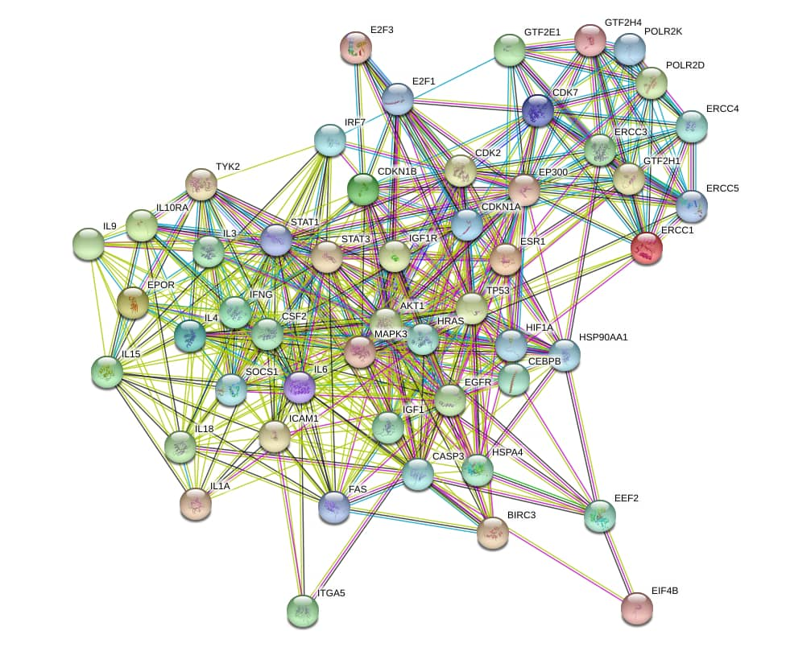
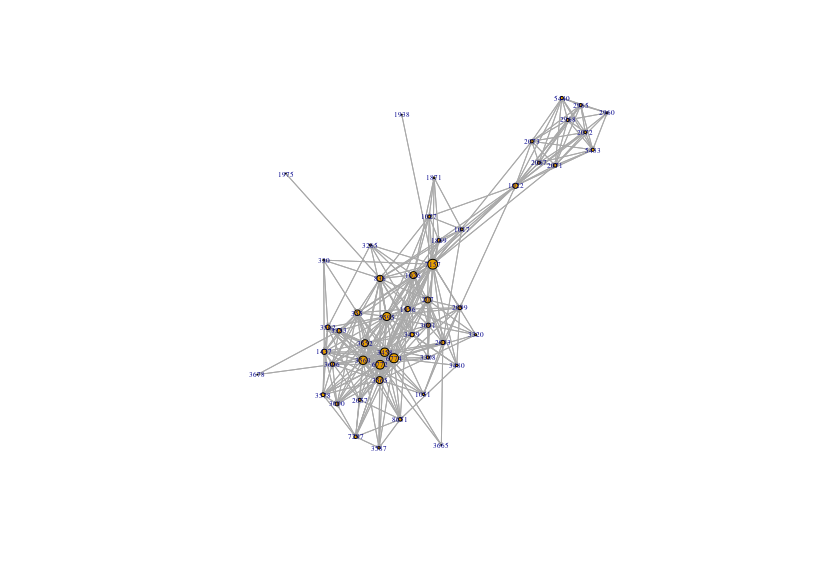
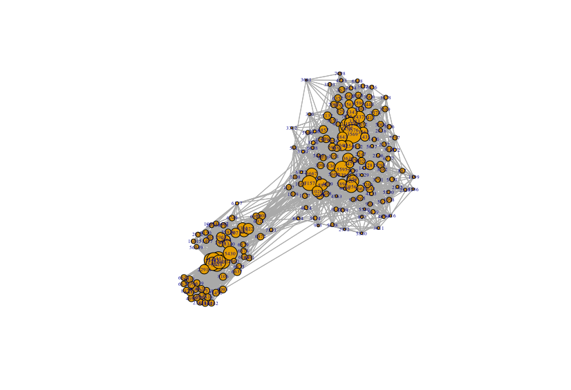

```{r, eval = TRUE, echo = FALSE, message=FALSE, results='hide'}
 suppressMessages(library(MODifieRDev))
```

```{r setup, include = FALSE}
knitr::opts_chunk$set(
  collapse = TRUE,
  comment = ""
)
knitr::opts_chunk$set(package.startup.message = FALSE)
```
```{r, eval = TRUE, echo = FALSE, message=FALSE, results='hide'}
input_class <- c("MODifieR_input", "Expression")


head_diff_genes <- structure(list(gene = c("1", "10", "100", "1000", "10000", "100009676"
), pvalue = c(0.976932866477861, 0.347847171880988, 0.0065044563904408, 
0.329104065723672, 0.115466316403267, 0.433955895521179)), .Names = c("gene", 
"pvalue"), na.action = structure(20527L, .Names = "20527", class = "omit"), row.names = c(NA, 
6L), class = "data.frame")

head_limma_table <- structure(list(logFC = c(4455.89841269841, 883.55873015873, 1995.84761904762, 
845.220634920635, 339.174603174603, 1924.13015873016), AveExpr = c(2263.4, 
710.8125, 1046.25, 549.20625, 240.1, 1276.3625), t = c(16.218193569236, 
16.0344692603521, 12.893841971902, 12.8919807201718, 11.961965943234, 
10.4610456719081), P.Value = c(6.97363464726655e-11, 8.19413749499862e-11, 
1.72104960554299e-09, 1.72447213222819e-09, 4.80220565401249e-09, 
2.90257092745431e-08), adj.P.Val = c(2.14305374975446e-06, 2.14305374975446e-06, 
2.2550490955115e-05, 2.2550490955115e-05, 5.02377942288863e-05, 
0.000228064005623852), B = c(-0.488932500581053, -0.496196966582733, 
-0.665191557315334, -0.66532421985713, -0.738246736058062, -0.890719235223792
), PROBEID = c("204439_at", "213294_at", "214453_s_at", "227609_at", 
"219352_at", "202086_at"), IDENTIFIER = c("10964", "5610", "10561", 
"94240", "55008", "4599")), .Names = c("logFC", "AveExpr", "t", 
"P.Value", "adj.P.Val", "B", "PROBEID", "IDENTIFIER"), row.names = c(NA, 
6L), class = "data.frame")

head_annotated_exprs <- structure(c(35.6, 1.9, 73.1, 17.1, 105.5, 6.1, 57.4, 2.3, 69.4, 
13.7, 124.3, 11, 11.9, 1.2, 77.6, 18.7, 113.4, 3.2, 29.7, 1.5, 
113.3, 4.3, 70.1, 27.1, 64.3, 2, 122.8, 20.9, 147.5, 16.1, 95.7, 
2.1, 113.9, 26, 136, 40.7, 39.3, 1.8, 78.9, 16.8, 182.6, 13.9, 
44.2, 2.1, 58.4, 23.1, 343, 19.1, 12.9, 1.4, 83, 26.9, 248.8, 
11.9, 29, 0.9, 105.3, 8.8, 70.5, 18.1, 41.1, 1.3, 203.6, 3.5, 
64.6, 30.6, 41.4, 1.4, 144.2, 35.6, 217.1, 22.5, 39.3, 1.4, 122.8, 
9.6, 113.9, 9.2, 108.9, 1.7, 142.5, 4.3, 180.3, 2.9, 37.7, 28.1, 
192, 19.8, 93.8, 32.1, 3.8, 1.1, 74.2, 16.6, 154.7, 14.8), .Dim = c(6L, 
16L), .Dimnames = list(c("1", "10", "100", "1000", "10000", "100009676"
), c("GSM101962", "GSM101963", "GSM101964", "GSM101965", "GSM101966", 
"GSM101967", "GSM101968", "GSM101969", "GSM101970", "GSM102710", 
"GSM102711", "GSM102712", "GSM102713", "GSM102714", "GSM102715", 
"GSM102716")))

group_indici <- structure(list(Control = 1:9, Patient = 10:16), .Names = c("Control", 
"Patient"))

ppi_head <- structure(list(entrez1 = c("5341", "23647", "8853", "5921", "50807", 
"3002"), entrez2 = c("381", "381", "381", "381", "381", "4074"
), SCORE = c(896, 917, 973, 756, 894, 735)), .Names = c("entrez1", 
"entrez2", "SCORE"), row.names = c(NA, 6L), class = "data.frame")
```
#Installation 

MODifierDev requires Python 3 with additional Python libraries scipy, sqlite3, numpy and networkx. They are a standard part of Anaconda
so installing Anaconda is recommended. It can be downloaded here:

[Anaconda](https://www.anaconda.com/)

In addition, some R packages are required. They can be acquired with the following code:
```{r, eval=FALSE, echo=TRUE}
if (!requireNamespace("BiocManager", quietly = TRUE))
    install.packages("BiocManager")
BiocManager::install(c("AnnotationDbi",
                       "MODA", 
                       "STRINGdb", 
                       "limma", 
                       "org.Hs.eg.db"), 
                     version = "3.8")


install.packages(c("foreach", 
                   "doParallel", 
                   "Rcpp", 
                   "dynamicTreeCut", 
                   "flashClust", 
                   "reticulate", 
                   "plyr", 
                   "parallel", 
                   "igraph", 
                   "WGCNA",
                   "RSQLite"
                   "stackoverflow"))
```

After that, the package can be installed from github:
```{r, eval=FALSE, echo=TRUE}
devtools::install_git(url = "https://github.com/ddeweerd/MODifieRDev.git")
```

#Introduction
Cells are organized in a modular fashion, where essential functions are carried out by functional
modules. Modules can be described as clusters of genes, gene products or metabolites that interact
together, are co-regulated or physically interacting. Complex diseases rarely arise from a single
causal factor but rather from multiple factors, with large individual variation. This leads to
dysregulation of parts of functional modules and thereby gives rise to a disease phenotype. The
underlying perturbation in parts of the functional modules and the connectivity between them
makes up a disease module.

To better understand complex diseases it is crucial to identify disease modules. Genes present in the
module might not have a significant impact on the disease on its own. However, the cumulative
effect of multiple low penetrance genes could play a major role in the pathogenesis of complex
diseases. Network-based approaches could be key in detecting these low penetrance genes, which
could potentially be novel biomarkers or therapeutic targets.

Various disease module inference methods have been proposed earlier, using different approaches.
Here, MODifieR is presented, an R package that bundles 8 different disease module inference
methods into a single package. The 8 methods methods can be classified into 3 different algorithmic
classes: seed-based, clique based and co-expression based methods. MODifieR is available under
the GNU GPL open source license.

Module inference methods included are:

Clique Sum         
Correlation Clique
DIAMoND            
DiffCoEx          
MCODE              
MODA             
Module Discoverer  
WGCNA trait-based


# How to run
This is an explanation on how to run the package. It starts with a short description on the core objects
followed by an explanation on how to use the functions. The package also includes example data enabling
the user to follow this tutorial.

## Core objects

The package is build on two core objects, an input and a module object.

### Input object

The first object is an input object for the disease module inference methods, with class `MODifieR_input`. 
This object can be used for all disease module inference methods. 

The `MODifieR_input` object is a named list and can contain the following components:

`diff_genes` A 2 two column data.frame where the first column are genes and the second column unadjusted p-values
obtained by differential expression analysis.

`limma_probe_table` A data.frame from `limma topTable` with added gene annotation.

`annotated_exprs_matrix` A matrix where the rows are genes and the columns samples. Probes have been collapsed
into genes.

`expression_matrix` An expression that has been used as input for the annotated expression matrix.

`annotation_table` A data.frame containing the annotation for the microarray probes. Also part of the input

`group_indici`A named list containing 2 numeric vectors. The names are the group labels, for example "patient" and 
"control". The values are the indici for each group, so the column indici for the expression matrix for 
each of the aformentioned groups.


The input object contains all necessary input data for the methods.
Below is a table showing what methods use an expression matrix, Differentially Expressed Genes (DEGs) or both.

|Method             | Annotated expression matrix | DEGs|
|:------------------|:---------------------------:|:---:|
|Clique Sum         |                             |   X |
|Correlation Clique |       X                     |   X |  
|DIAMoND            |                             |   X |
|DiffCoEx           |       X                     |     |
|MCODE              |                             |   X |
|MODA               |       X                     |     |
|Module Discoverer  |                             |   X |
|WGCNA trait-based  |       X                     |     |
Table 1: Input types taken by inference methods

### Module object

The second object, with class `MODifieR_module` is an object that is produced by the disease module
inference methods. They also have a subclass according to the method that produced them.

Like the input object, the module objects are also named lists. Module objects differ between each function that generates them (hence the subclass) but have certain features in common:

- The module object will always contain an element (character vector) called module_genes which are the genes that make up
the final module

- The module object will always contain a named list called settings which holds the parameters that have been used when generating the object


## Creating an input object

In order to run an analysis, an input object has to be created. This can be done in two ways:
The first is the usual way and involves microarray data and probe annotation.
The second way is to create a custom object using previously obtained DEGs or expression data

### Using microarray data

To create an input object with microarray data, the function `create_input` can be used. The function 
takes several inputs:

- `expression_matrix` A matrix with normalized expression values. The rows are probes and the columns are samples.

- `annotation_table` An two columns dataframe providing annotation for the probes. The first column should contain the probe
ID, and the second column its corresponding annotation.

- `group1_indici` A vector that should have the indici in the expression matrix for the samples belonging to group 1.

- `group2_indici` Same, but for group 2

- `group1_label` Label to identify group 1, for example "Control" or "Patient"

- `group2_label` Same, but for group 2

- `expression` A boolean value indicating if expression matrix data should be calculated.

- `differential expression` A boolean value indicating if DEGs data should be calculated.

- `method` When collapsing the probes, the collapseRows() method from WGCNA is used. This argument
determines the collapsing method to use. Please see the WGCNA documentation for more information. Options are:
    - _MaxMean_         Highest mean value
    - _MinMean_         Lowest mean valie
    - _MaxRowVariance_  Highest variance
    - _absMaxMean_      Highest mean absolute value 
    - _absMinMean_      Lowest mean absolute value
    - _ME_              Eigenrow (first principal component)

To serve as an example, example data has been included. There is an example expression matrix 
from Gene Expression Omnibus (GEO) with accession number GSE4588. This dataset has 16 columns, 
so 16 samples in total with 9 _systemic lupus erythematosus_ (SLE) patients and 7 healthy controls. 
The matrix has 52307 rows, meaning 52307 probes. The indici for the healthy controls are 1 to 9, 
and 10 to 16 make up the SLE patients. The expression matrix can be accesed using `expression_matrix`

We can inspect it using the head function:

```{r, eval=TRUE, echo=TRUE}
head(expression_matrix)
```

The annotation for the probes is provided in a data.frame accesible through `probe_annotation`.
The first column contains the probe ids where the second column holds the corresponding annotation,
in this case ENTREZ gene identifiers.

Again using head:

```{r, eval=TRUE, echo=TRUE}
head(probe_annotation)
```
Now we can put these things together to create an input object:

```{r, eval=FALSE, echo=TRUE}
MODifieR_input <- create_input(expression_matrix = expression_matrix,
                               annotation_table = probe_annotation,
                               group1_indici = 1:9,
                               group2_indici = 10:16,
                               group1_label = "Control",
                               group2_label = "Patient")
                              
```
When the function has finished, it might take a few minutes, we can inspect the object.
Let's start with the class:
```{r, eval=TRUE, echo=FALSE}
input_class
```
Now we can inspect the DEGs:
```{r, eval=TRUE, echo=FALSE}
head_diff_genes
```
The limma_probe_table is the table generated by limma with annotation for the probe added:
```{r, eval=TRUE, echo=FALSE}
head_limma_table
```
Finally, we can take a look at the groups indici and it's names by looking at the
group_indici component of the object
```{r, eval=TRUE, echo=FALSE}
group_indici
```
Now we have set up an input object to use in the disease inference methods!

### Creating a custom input object
There is also the possibility to create a custom input object. This can be useful in cases
where there are already DEGs, an annotated expression or both available. In order to create such
an object, the function `create_custom_input_object` can be used.

Below is an example on how to use this function. Some of the input data is optional, for
example limma_probe_table, expression_matrix and annotation_table are not used in any 
disease module inference method. Instead, they can optionally be used to update or recalculate
an input object.

```{r, eval=FALSE, echo=TRUE}
generic_input_object <- create_custom_input_object(diff_genes = NULL, 
                                                   limma_probe_table = NULL,
                                                   annotated_exprs_matrix = NULL, 
                                                   expression_matrix = NULL, 
                                                   annotation_table = NULL, 
                                                   group1_indici = NULL,
                                                   group2_indici = NULL, 
                                                   group1_label = NULL, 
                                                   group2_label = NULL)
```
Please note that the specific data in the input object that is required differs per 
inference method, the reader is referred to table 1 in subsection 'Input object' to see 
what inference methods needs what input data fields. For example, to use the DIAMoND method,
only the diff_genes input would suffice to run the analysis.

If the inference method requires annotated expression matrix, group indici and
labels are also required.

## Inference methods

Disease module inference methods that have DEGs as input need a Protein-Protein interaction (PPi) 
network to overlay the DEGs on. As an example, a small STRING db PPi network has been included.
This PPi network is from STRING version 7.1 and is filtered for interactions with a confidence score
higher than 700. This small network only contains 5541 unique genes and 64672 interactions.
The first column is interactor gene 1, the second column is interactor gene 2 and the third and last column
gives the STRING confidence score. [@Jensen2007]
Using head again, we can inspect the first few rows:
```{r, eval=TRUE, echo=TRUE}
ppi_head
```

Since this is a tutorial on how to run the inference methods, we can change parameters for some inference 
methods and also make the size of the input object a little smaller to reduce runtime.

Also, we can lower the number of genes in the annotated expression matrix:
```{r, eval=FALSE, echo=TRUE}
MODifieR_input$annotated_exprs_matrix <- MODifieR_input$annotated_exprs_matrix[1:10000, ]
```

In addition, some inference methods allow to modify the module object after analysis. If an inference method has these
functions, they will be shortly discussed in separate subsections of the inference method.


### Clique Sum

There are two different versions of the Clique Sum algorithm implemented, `clique_sum_exact` and `clique_sum_permutation`, that differ in the method to determine if a clique is significantly enriched with DEGs. Obtaining cliques is done in a separate function, `build_clique_db`, that creates an SQLite database for the cliques. This is because obtaining cliques is a computationally intersive process, may clog the memory when using a large network and is static for each network. 

Both versions take in the filename of this database instead of a PPi network.

#### build_clique_db

This function is used to create a clique database. `db_folder` is the folder where database will be stored and `db_name` is the name of the database. .sqlite will be appended to the database name.

```{r, eval=FALSE, echo=TRUE}
build_clique_db(ppi_network = ppi_network, 
                db_folder = "/folder/name", 
                db_name = "example")
```

#### clique_sum_exact

clique_sum_permutation is an implementation of the clique-based disease module inference method proposed by Barrenäs et al. [@Barrenas2012]

Enrichment of cliques is determined by a one-sided Fisher exact test.


In MODifieR, the function can be called using `clique_sum_exact()` and using the filename of the database created in the function `build_clique_db` as input for the db parameter.


```{r, eval=FALSE, echo=TRUE}
clique_sum_exact_module <- clique_sum_exact(MODifieR_input = MODifieR_input, 
                                db = "folder/name/example.sqlite")
```

#### clique_sum_permutation

clique_sum_permutation is a variation of the clique-based disease module inference method proposed by Barrenäs et al. [@Barrenas2012], [@Gustafsson2014]

Enrichment of cliques is determined by comparing the sum of the -log 10 p-values for all genes in the clique and comparing that to a null distribution of cliques composed of random genes of the same size.


In MODifieR, the function can be called using `clique_sum_permutation()` and using the filename of the database created in the function `build_clique_db` as input for the db parameter.


```{r, eval=FALSE, echo=TRUE}
clique_sum_permutation_module <- clique_sum_permutation(MODifieR_input = MODifieR_input, 
                                db = "db_name = "example"")
```


### Correlation Clique

The correlation clique is a clique-based algorithm using consensus clustering.
The algorithm starts with calculating a correlation score between each interaction in the PPi network.
The correlation score is obtained by subtracting the Pearson correlation p-value:
$correlation score = 1 - Pearson\: p\: value$

Subsequently, the correlation score is multiplied by 
the correlation confidence.
$edge score = \sqrt{(correlation score * confidence score  )} $

When the edge scores are calculated the iterative part of the algorithm commences:
All edge scores are scaled to so that the mean of all edge scores is equal to the `fraction_of_iteration` parameter. Next, the newly scaled scores are compared to random variables from the uniform distribution between (0,1) and only interactions where the edge score is higher than the random variable are used to construct a new PPi network. Because the scores are scaled to `fraction_of_iteration`, this is the average fraction of interactions used for this new network. Then, maximal cliques are inferred from this new network.
The cliques are tested for significant enrichment of DEGs by Fisher's exact test and
the union of significant cliques is the disease module for this iteration.
The final disease module will consist of genes that have been present in at least `frequency cutoff` iterations

The function can be called using `correlation_clique()`

In the example code, the number of iterations has been reduced to 10 (from 50) to speed up the analysis
```{r, eval=FALSE, echo=TRUE}
correlation_clique_module <- correlation_clique(MODifieR_input = MODifieR_input, 
                                                ppi_network = ppi_network, 
                                                iteration = 10)
```

###### Post-processing
Correlation clique offers two post-processing functions. 

The first one, `correlation_adjust_cutoff`, allows to adjust the `frequency_cutoff` parameter. The default is 0.5, 
meaning the gene has to be present in at least 50 percent of iterations. In this example it is
set to 0.2, so 20 percent of iterations.

```{r, eval=FALSE, echo=TRUE}
correlation_clique_module <- correlation_adjust_cutoff(frequency_cutoff = 0.2, 
                             correlation_module = correlation_clique_module)
```

The second post-processing function is `correlation_set_module_size`. This function is intented to return a module
where the number of module genes is closest to `size`. In the example, we set the desired size to 10.  

```{r, eval=FALSE, echo=TRUE}
correlation_clique_module <- correlation_set_module_size(size = 10, 
                             correlation_module = correlation_clique_module)
```

### DIAMoND

A slightly modified version of the original DIAMOnD python script [@Ghiassian2015] is called from within R.
The only change to the orginal algorithm is the option to include the seed genes to the module.

In MODifieR, the function can be called using `diamond()`
```{r, eval=FALSE, echo=TRUE}
diamond_module <- diamond(MODifieR_input = MODifieR_input, 
                          ppi_network = ppi_network)
```

###### Post-processing

Post-processing DIAMOnD modules entails either to remove or add the seed genes. To do this, there are 2 related functions,
`add_diamond_seed_genes` and `remove_diamond_seed_genes`

```{r, eval=FALSE, echo=TRUE}
diamond_module <- diamond_add_seed_genes(diamond_module = diamond_module)

diamond_module <- diamond_remove_seed_genes(diamond_module = diamond_module)
```

### DiffCoEx

DiffCoEx is a method for identifying correlation pattern changes, 
which builds on the commonly used Weighted Gene Coexpression Network Analysis (WGCNA) 
framework for coexpression analysis. [@Tesson2010]

In MODifieR, the function can be called using `diffcoex()`
```{r, eval=FALSE, echo=TRUE}
diffcoex_module <- diffcoex(MODifieR_input = MODifieR_input)
```

###### Post-processing

In the DiffCoEx algorithm, co-expression modules are denoted by color. The final disease module can be 
composed of multiple colors. The function `diffcoex_split_module_by_color`
allows to split each of these colors into separate MODifieR_module objects. 
The return object is a list of MODifieR module objects.

```{r, eval=FALSE, echo=TRUE}
diffcoex_module_list <- diffcoex_split_module_by_color(diffcoex_module = diffcoex_module)
```

### MCODE

A clique based algorithm to identify disease modules from differentially expressed genes originally by Bader et al. [@Bader2003]

Much of the code and documentation has been taken from the now defunct package "ProNet"

In MODifieR, the function can be called using `mod_mcode()`
```{r, eval=FALSE, echo=TRUE}
mcode_module_list <- mod_mcode(MODifieR_input = MODifieR_input, 
                          ppi_network = ppi_network)
```

The return type of MCODE is a list (of MCODE modules), as it generally returns multiple modules sorted by 
decreasing score. Here, we take out it the first one:

```{r, eval=FALSE, echo=TRUE}
mcode_module <- mcode_module_list[[1]]
```

### MODA

This implementation follows a workflow as described in the MODA vignette. [@MODA2016] 
First, two separate networks are constructed, a background network containing 
expression data from all samples and a condition specific network consisting 
of all samples minus the condition specific samples. Then, hierarchical clustering 
is performed and cutting height estimated from either maximal average density or modularity

Condition specific co-expression modules are then extracted using the Jaccard index and specificTheta.

The final module will consist of the co-expression module 
that has the minimal Jaccard index complemented by co-expression modules that have a Jaccard index 
below this minimal + `specificTheta`.

In MODifieR, the function can be called using `moda()`
```{r, eval=FALSE, echo=TRUE}
moda_module <- moda(MODifieR_input = MODifieR_input, 
                    group_of_interest = 2)
```

###### Post-processing

After the MODA analysis is complete, the `specificTheta` parameter can be adjusted with the function
`moda_change_specific_threshold`. In the example it is set to 0.05 (default is 0.1)

```{r, eval=FALSE, echo=TRUE}
moda_module <- moda_change_specific_threshold(moda_module = moda_module, 
                                              specificTheta = 0.05)
```

### Module Discoverer

This is an implementation of the single seed Module Discoverer algorithm. The code has been adapted 
from the orignal code by Vlaic et al. [@Vlaic2018] For details, please see the paper referenced.

In MODifieR, the function can be called using `modulediscoverer()`
```{r, eval=FALSE, echo=TRUE}
module_discoverer_module <- modulediscoverer(MODifieR_input = MODifieR_input, 
                                             ppi_network = ppi_network, 
                                             permutations = 1000, 
                                             repeats = 3)
```

### WGCNA trait-based

Wgcna is an implementation of WGCNA [@WGCNA2008], [@WGCNA2012] that associates 
co-expression modules (denoted by color) to a trait. 
Co-expression modules with an adjusted p-value < pval_cutoff will make up the final disease module.

The algorithm infers co-expression modules from combined expression dataset from both group1 and group2. 
Co-expression modules are then correlated to trait (group 1 ~ group 2).

In MODifieR, the function can be called using `wgcna()`
```{r, eval=FALSE, echo=TRUE}
wgnca_module <- wgcna(MODifieR_input = MODifieR_input)
```

###### Post-processing

There are 4 functions available to post-process WGCNA module objects.

The first one, `wgcna_adjust_significance`, allows to adjust the p-value for inclusion of co-expression modules into the final disease
module. The boolean parameter `use_unadjusted` denotes if the adjusted (FDR correction) or unadjusted p-value 
is to be used. 
```{r, eval=FALSE, echo=TRUE}
wgnca_module <- wgcna_adjust_significance(pval_cutoff = 0.1, 
                                          wgcna_module = wgnca_module,
                                          use_unadjusted = FALSE)
```

With the second function `wgcna_get_modules_genes_by_sign` retuns a module object that either consists of co-expression colors
positively or negatively correlated to the trait. To get only colors positively correlated to trait in the resulting module,
the `mode` parameter can be set to "p". To only get negatively correlated colors, use "n".

```{r, eval=FALSE, echo=TRUE}
wgnca_module <- wgcna_get_module_genes_by_sign(wgcna_module = wgnca_module, 
                                               mode = "p")
```

In the wgcna algorithm, co-expression modules are denoted by color. The final disease module can be 
composed of multiple colors. The function `wgcna_split_module_by_color` allows to split each of these 
colors into separate MODifieR_module objects. Only colors significantly associated to the trait will be used.
The return object is a list of MODifieR module objects.

```{r, eval=FALSE, echo=TRUE}
wgnca_module <- (wgcna_module = wgnca_module)
```

The second post-processing function is `wgcna_set_module_size`. This function is intented to return a module
where the number of module genes is closest to `size`. In the example, we set the desired size to 200. 

```{r, eval=FALSE, echo=TRUE}
wgnca_module <- wgcna_set_module_size(size = 200,
                                      wgcna_module = wgnca_module)
```

## Consensus modules

A consensus module can be derived with the function `create_module_set()`. It will return a module object of 
class `MODifieR_module`, same as the individual methods. The subclass is `Module_set`.

The method currently implemented to derive a consensus module from a set of modules is by tabulating the presence
of each gene in the individual methods. The next step is to set a minimum for this presence; for example, 
a gene has to be present in at least 3 of the individual modules.

To start deriving a consensus module, it is convenient to wrap all the previously acquired modules into a list:

```{r, eval=FALSE, echo=TRUE}
module_list <- list(clique_sum_module, 
                    correlation_clique_module, 
                    diamond_module, diffcoex_module, 
                    mcode_module, 
                    moda_module, 
                    module_discoverer_module, 
                    wgcna_module)
```

Now the maximal number of modules that share at least one gene can be retrieved:

```{r, eval=FALSE, echo=TRUE}
max_frequency <- get_max_frequency(module_list)
```

The maximum in this particular example turns out to be 5. This value can be used to retrieve all consensus modules, from a minimum
presence of 1 (union of modules) up to 5:

```{r, eval=FALSE, echo=TRUE}
consensus_modules <- lapply(X = 1:max_frequency, FUN = create_module_set, 
                            module_list = module_list)
```

A list of length 5 with `Module_set` objects is returned. In this tutorial the fourth element in the list,
so the consensus module where genes are present in at least 4 individual methods will be inspected.  

```{r, eval=FALSE, echo=TRUE}
consensus_module4 <- consensus_modules[[4]]
```

Like other module objects, it has vector containing the module genes and a list containing the settings.
In addition, it has the following elements:

- `module_gene_list` A named list containing the module genes from the original modules  

- `gene_frequency`Table containing all the genes present in the modules and their frequency  

- `method_by_gene` A named list where the elements are the modules the genes have been found in 
and the names are the gene names  

- `gene_by_method` A table containing the gene frequencies by combination of methods  

The resulting module object can now be used for further analysis. 

In this example the module genes from consensus_module4 are written to a file:

```{r, eval=FALSE, echo=TRUE}
write.table(x = consensus_module4$module_genes, 
            file = "consensus4_genes.txt", 
            quote = F, 
            row.names = F, 
            col.names = F)
```

And uploaded into [String](https://string-db.org). This resulted in Figure 1 and Table 2.




|pathway ID|pathway description                     |observed gene count|	false discovery rate|
|:---------|:---------------------------------------|:-----------------:|---------------------|
|GO.0005515|protein binding                         | 39                |	1.18E-13            |
|GO.0005102|receptor binding                        |	19                |	4.56E-09            |
|GO.0005126|cytokine receptor binding               |	 8                |	5.35E-05            |
|GO.0005125|cytokine activity	                      | 7	                |7.83E-05             |
|GO.0005488|binding	                                | 42                |	0.000111            |
|GO.0003684|damaged DNA binding	                    |5                  |	0.000192            |
|GO.0030235|nitric-oxide synthase regulator activity|	3	                |0.000192             |
|GO.0008022|protein C-terminus binding              |	6	                |0.000392             |
|GO.0043566|structure-specific DNA binding          |	7	                |0.000445             |
|GO.0019899|enzyme binding                          |	14	              |0.00062              |
Table 2: Excerpt from Molecular Function GO term table on the result page of [String](https://string-db.org)

## General functions

### Plotting

A very crude plotting function has been implemented to plot MODifieR module objects. To do this, the regular function
`plot()` can be used. It takes an additional argument, a PPi network to overlay the module genes on. The size of the 
nodes on the plot is dependent on degree, nodes with a high degree are larger. In general, the plots are not great but can
be used in an exploratory fashion when inferring modules.


Plotting consensus_module4 again with the example PPi included in MODifieRDev:

```{r, eval=FALSE, echo=TRUE}
plot(consensus_module4$module_genes, ppi_network = ppi_network)
```



The plot is not as nice as the plot from string-db.org. The built-in plot function can be used 


```{r, eval=FALSE, echo=TRUE}
plot(consensus_module4$module_genes, ppi_network = ppi_network)
```



# References


